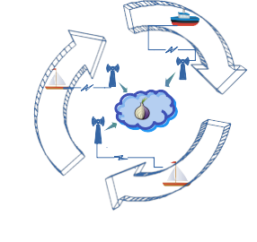
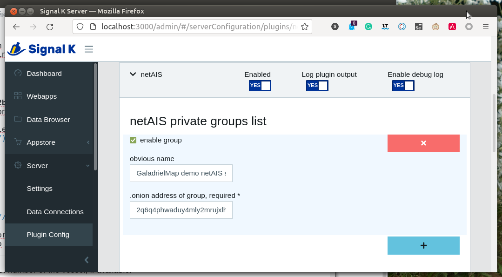
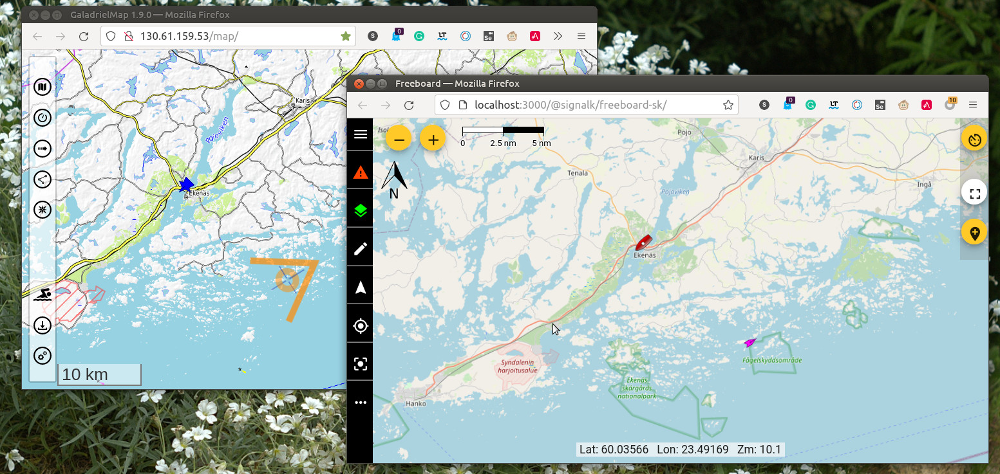
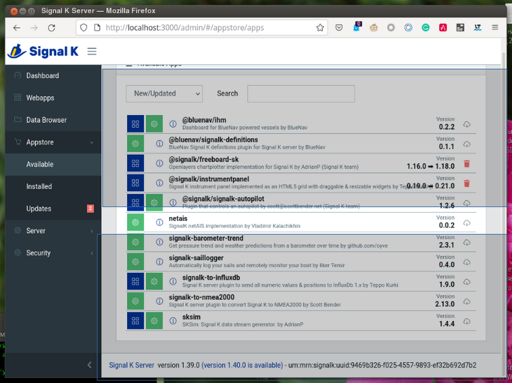

[Русское описание](https://github.com/VladimirKalachikhin/netAIS-Signal-K/blob/master/README.ru-RU.md)
# netAIS Signal K plugin[](https://creativecommons.org/licenses/by-sa/4.0/)

## v. 0.1

Exchange AIS-like messages via the Internet to watch position members of your private group. No need for a dedicated server with a real IP address.  
Suitable for fishing, regatta and collective water recreation.  

   
Software use [TOR](https://en.wikipedia.org/wiki/Tor_(network)) as a communication environment, so it works smoothly via mobile internet and public wi-fi.

## Features
* Service one private group.
* Membership in any number of groups.

## Technical
Plugin includes a client and a server for one private group. The server must be configured as a TOR hidden service.  
You must get .onion address of this hidden service in any way - by email, SMS or pigeon post, and configure the client with it.  
The client calls to the server with spatial and other info in AIS-like format. Server return info about all of the group members.  

## Demo
Public group for testing:  
**2q6q4phwaduy4mly2mrujxlhpjg7el7z2b4u6s7spghylcd6bv3eqvyd.onion**  This address are default on client configuration interface.  
   
All active group members are visible on  [GaladrielMap](http://galadrielmap.hs-yachten.at/) [Live demo](http://130.61.159.53/map/).   
   

## Compatibility
Signal K server. 

## Install&configure:
You must have [TOR service](https://community.torproject.org/onion-services/setup/install/) installed.  
Install plugin from Signal K Appstore as **netais**.  
   
Restart Signal K,  
Use Server -> Plugin Config menu to configure plugin.   
Press Submit to save changes.

### TOR hidden service
If TOR is in the same computer as SignalK, [configure TOR hidden service](https://community.torproject.org/onion-services/setup/) to serve localhost:3100 (default) address. Simplest way to it is just adding  

```
HiddenServiceDir /var/lib/tor/hidden_service_netAIS/   
HiddenServicePort 80 localhost:3100  
```

strings to "location-hidden services" section of `/etc/tor/torrc.`
After restart TOR, get address you hidden service by  
```
sudo cat /var/lib/tor/hidden_service_netAIS/hostname  
```

   

If TOR is on a different computer than SignalK, replace `localhost` with the SignalK address.

It's all no need if you want to be a group member only. But a working TOR should be.

## Usage
Any Signal K chartplotters will show netAIS targets in the usual way.

## Support
[Discussions](https://github.com/VladimirKalachikhin/Galadriel-map/discussions)

The forum will be more lively if you make a donation [via PayPal](https://paypal.me/VladimirKalachikhin)  at [galadrielmap@gmail.com](mailto:galadrielmap@gmail.com) or at [ЮMoney](https://yasobe.ru/na/galadrielmap)

[Paid personal consulting](https://kwork.ru/it-support/20093939/galadrielmap-installation-configuration-and-usage-consulting)  
