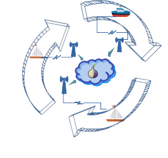
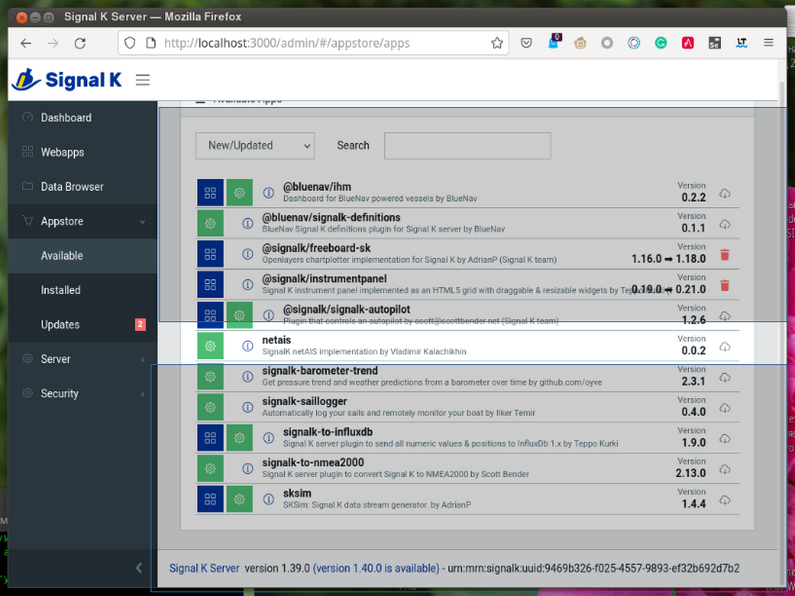
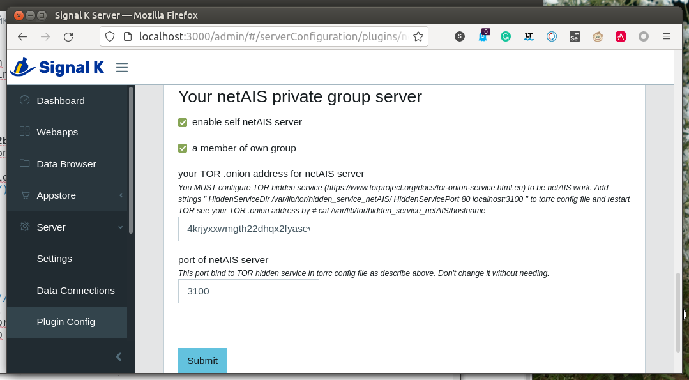

# netAIS плагин для Signal K[](https://creativecommons.org/licenses/by-sa/4.0/)

## v. 0.1
Обмен AIS-подобными сообщениями с координатами и сопутствующей информацией через Интрнет между участниками выделенной частной группы. Для взаимодействия не требуется интернет-сервер с реальным адресом.

Удобно для организации коллективного плавания, соревнований, рыбалки.

   

Плагин использует [TOR](https://ru.wikipedia.org/wiki/Tor) как среду коммуникации, и функционирует и через мобильный интернет и через публичные точки доступа wi-fi без дополнительных настроек.  

## Возможности
* Создание одной выделенной группы
* Участие в любом количестве выделенных групп

## Технические детали
Плагин содержит клиентскую часть -- собственно для обмена сообщениями, и серверную часть, обеспечивающую эту возможность. Один сервер обслуживает одну выделенную группу и является скрытым сервисом TOR.  Если вы хотите организовать собственную группу, .onion адрес этого сервиса надо передать потенциальным членам группы каким-нибудь сторонним способом -- в sms, электронной или голубиной почтой. Каждый член вашей группы указывает этот адрес в своём клиенте, и клиент получает возможность обмениваться информацией с сервером через сеть TOR. В адресах обычного интернета нет необходимости.

## Демо
Общедоступная группа netAIS для тестовых целей:  
**2q6q4phwaduy4mly2mrujxlhpjg7el7z2b4u6s7spghylcd6bv3eqvyd.onion**  Этот адрес является умолчальным в настройках плагина.  
   
Все активные участники группы видны в [демонстрационной версии](http://130.61.159.53/map/) [GaladrielMap](http://galadrielmap.hs-yachten.at/).  
   

## Совместимость
Сервер Signal K 

## Установка и конфигурирование:
У вас должна быть установлена [служба TOR](https://community.torproject.org/onion-services/setup/install/).  
Установите плагин с именем **netais** обычным образом из Signal K Appstore.   
   
Перезапустите Signal K.  
В меню Server -> Plugin Config настройте плагин.   
Не забывайте нажимать Submit для сохранения настроек.

### Скрытый сервис TOR

[Настройте скрытый сервис TOR](https://community.torproject.org/onion-services/setup/) на 
адрес localhost:3100. Самый простой способ это сделать -- это добавить строки  
```
HiddenServiceDir /var/lib/tor/hidden_service_netAIS/   
HiddenServicePort 80 localhost:3100  
```
в раздел location-hidden services" файла `/etc/tor/torrc`.  
Перезапустите TOR и посмотрите адрес в файле /var/lib/tor/hidden_service_netAIS/hostname, например, путём   
```
sudo cat /var/lib/tor/hidden_service_netAIS/hostname  
```
   
Не нужно настраивать скрытый сервис TOR, если вы не собираетесь держать свою группу netAIS, а хотите быть только членом других групп. Но сам TOR, конечно, должен быть.

## Использование
Любой картплотер Signal K будет показывать цели netAIS обычным образом.
 
## Поддержка
[Форум](https://github.com/VladimirKalachikhin/Galadriel-map/discussions)

Форум будет живее, если вы сделаете пожертвование [через PayPal](https://paypal.me/VladimirKalachikhin) по адресу [galadrielmap@gmail.com](mailto:galadrielmap@gmail.com) или на [ЮМани](https://yasobe.ru/na/galadrielmap).

Вы можете получить [индивидуальную платную консультацию](https://kwork.ru/training-consulting/20093293/konsultatsii-po-ustanovke-i-ispolzovaniyu-galadrielmap) по вопросам установки и использования netAIS.
